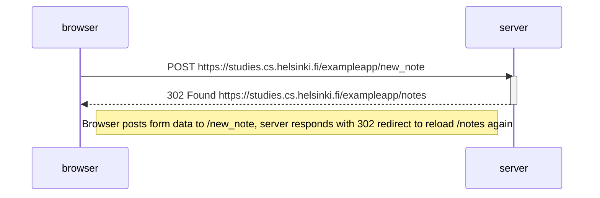

```mermaid

sequenceDiagram
    participant browser
    participant server

    browser->>server: POST https://studies.cs.helsinki.fi/exampleapp/new_note
    activate server
    server-->>browser: 302 Found https://studies.cs.helsinki.fi/exampleapp/notes
    deactivate server

    Note right of browser: Browser posts form data to /new_note, server responds with 302 redirect to reload /notes again

    


```